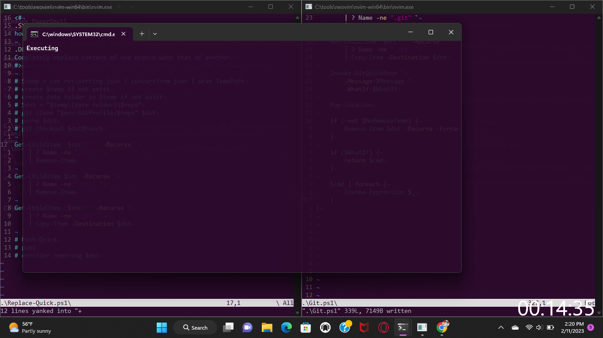

# credit
- github.com/jdhitsolutionis for ``PSClock``
- link
  - url: https://github.com/jdhitsolutionis/PSClock
  - retrieved: 2023-02-03

# todo
- [ ] feat: Edit-WorkDay
- [ ] feat: Get-WorkWeek
- [x] refactor: rename command (MinuteTimer.exe)
  - name: OverlayTimer.exe
- [x] new: git repo
- feat(New_WorkSchedule):
  - [x] prompt for each day of the new week, starting from the current day
  - [x] accept above as optional parameters
- [x] new: command to import new task file (and remove previous)
- [x] add(MyScript.ps1): this script requires (...).exe
- [x] refactor: use proper file structure

# I wish
- [ ] I would have the option to add work end times for record-keeping
  - [ ] Add optional ``-To`` parameter
    - if selected, overwrites any recorded instance of schedule end times
    - if not select, does not overwrite
      - parse record file, change ``To`` or ``EndTime`` property on request

# issue
- [x] 2022-10-11-141916
  - howto: \shortcut\bin\workschedule.bat
  - actual: registered task does not appear in Task Scheduler one day after registration
  - solution: change "days to remove" to 14
- [ ] 2023-02-11-142119
  - actual
    

